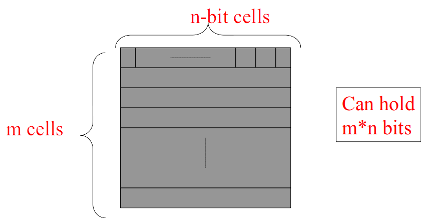
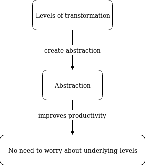
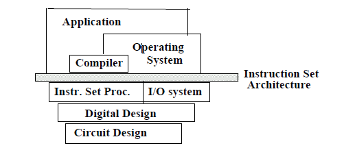

# Computer Architecture Lectures

- [x] [Lecture 1](#lecture-1)
- [x] [Lecture 2](#lecture-2)
- [ ] [Lecture 3](#lecture-3):construction:
- [ ] [Lecture 4](#lecture-4)
- [ ] [Lecture 5](#lecture-5)
- [ ] [Lecture 6](#lecture-6)

## Lecture 1

### What is inside a computer?

There are **five** classic components of a computer:
  1. **Processor**:
    * Divided into two groups:
      - **Data section (_data path_)**:
          * contains the registers and the Arithmetic Logic unit.
          * is capable of performing certain operations on data items.
      - **Control section**:
          * the control unit that generates control signals that direct the operation of memory and data path.
          * control signals do the following:
            - tell memory to send or receive data.
            - tell the ALU what operation to perform.
            - route data between different parts of the data path.

  1. **Registers**:
    * the storage element for data inside the CPU.
    * hold temporary data during calculations.
    * faster in accessing than memory.

  1. **Main Memory**:
    * Large collection of circuits, each capable of storing a single bit and is arranged in small cells.
    * Each cell has a unique address
    * Longer strings stored by using consecutive cells.

    

  1. **System Bus**:
    * Group of signal lines have the same function.
    * Allow transferring the signals between different parts of the computer and from one device to another.
    * There are **three** types of system buses:
      - _data_ bus:
        * transfers data from CPU to memory and vice-versa.
        * connects I/O ports and CPU.
      - _address_ bus: determines where the address of memory locations should be sent.
      - _control_ bus: determines the operation.

      

there are two pieces of information that should be known to solve this example:
1. If there are N address lines in address bus, that means we can directly address 2^N of memory locations.
in other words, if we have N address lines, then our memory has 2^N cell.

1. The number of data lines used in the data bus is equal to the
size of data word that can be written or read.

*Example:*

How many memory locations can be addressed by a microprocessor with 14 address lines?

N = 14
then number of memory locations (or memory cells) = 2^N = 2^14 locations.

*Example:*

Suppose that a computer’s Main Memory has 1013 cells. How many address lines are needed in order for all the cells to be usable?

2^N = 1013
then to get N we need to take log for base 2 for both sides
log(2^N) = ceil(log(1013))
N =  9.

---

### Levels of transformation

  

Abstraction
: A higher level only needs to know about the **interface** to the lower level, _not how the lower level is implemented._

### Convert C program to machine language:

Machine Language
: fundamental instructions expressed as 0s and 1s.

Assembly Language
: human-readable equivalent of machine language.

Assembler
: converts assembly language program to machine language.

Linker
:links separately assembled modules together into a single module suitable for loading and execution.

Loader
: part of operating system responsible for loading executable files into memory and execute them.

### What is computer architecture?

Simply:
>Computer Architecture = Machine organization + Instruction Set Architecture

* Instruction Set Architecture (ISA): Interfaces the software to the hardware, and provides support for programming.

* It provides the mechanism by which the software tells the
hardware what should be done.

## Lecture 2

**ISA Components:**
 - Storage cells: registers, memory.
 - Machine Instruction Set: set of possible operations.
 - The instruction format: Size and meaning of fields within the instruction.

**Every instruction need to specify four things:**
1. Which operation to perform.
1. Where to find the operand or operands, if there are operands.
1. Where to put the result, if there is a result.
1. Where to find the next instruction.

*Example:*
MOVE.W D4, D5

MOVE => operations
D4 => location of the operands
D5 => location to put the results
Find next instruction => implicitly in the word following this instruction.

**Instruction Cycle:**
<!-- place image of IC slide 9 -->

* Fetch: get the instruction from memory into the processor.
* Decode: internally decode what it has to do.
* Execute: take the values from the registers, actually add them together.
* Store: store the result back into another register.

**Classes of instructions:**
1. Data movement instructions: Load, Store.
1. Arithmetic and logic (ALU) instructions: Add, Sub, Shift...
1. Branch instructions(control flow instructions): Br, Brz.

**Program Counter (PC)**
* The program counter (PC) incremented during the instruction fetch to point to the next instruction to be executed.
* Controls program flow.

**Branch target address:**
* A target address is specified in a branch or jump instruction.
* The target address is loaded into the PC, replacing the address stored there.
* A branch may be:
  - Unconditional, as is the C goto statement.
  - Conditional, which means it depends on whether some condition within the processor state is true or false.

**Condition Code (CC):**
 - There is no machine instruction that corresponds directly to the conditional statements.
 - The approach most machines take is to set various status flags within the CPU as a result of ALU operations.
 - the condition code register also called
    * the processor status word (PSW).
    * the status register.
 - It is the bit or bits that describe the condition are stored in it.

**Hypothetical machine models:**

there are 5(0 -> 4) types of them:
  1. 3 address instruction: specifies memory addresses for both operands and the result.
  1. 2 address instruction: overwrites one operand in memory with the result.
  1. 1 address instruction: has a register, called the accumulator register to hold one operand & the result.
  1. 0 address instruction: uses a CPU register stack to hold both operands and the result.
  1. 4 address instruction: like 3 address but also allows the address of the next instruction to specified explicitly.

*[ALU]: Arithmetic Logic Unit
*[PSW]: Processor Status Word
